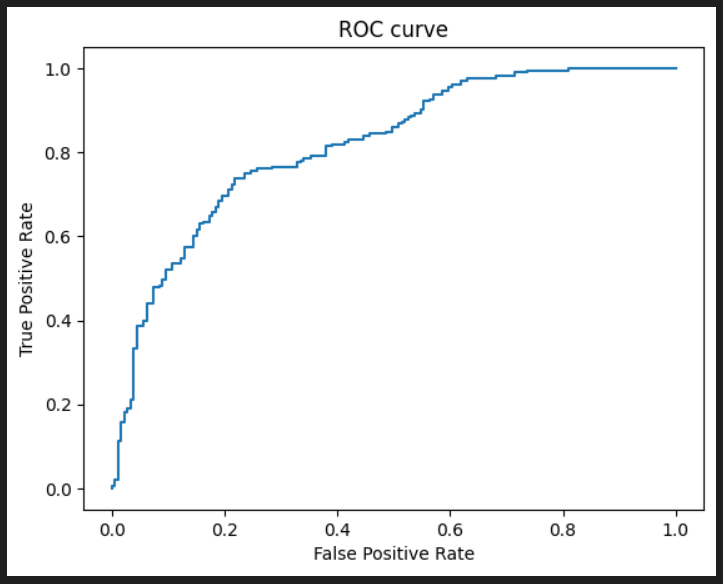
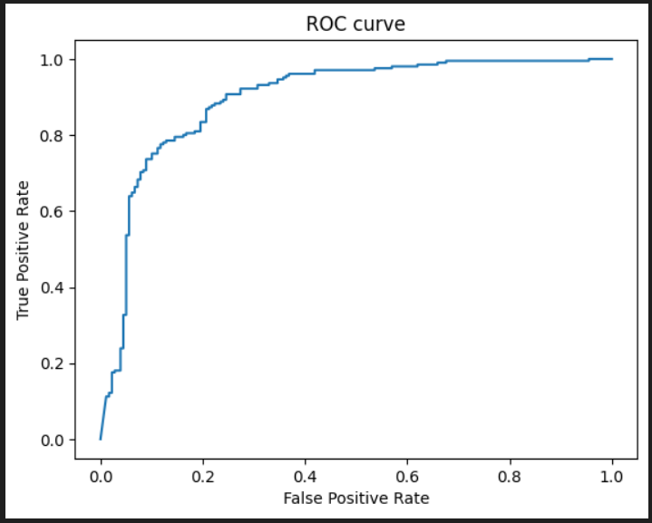
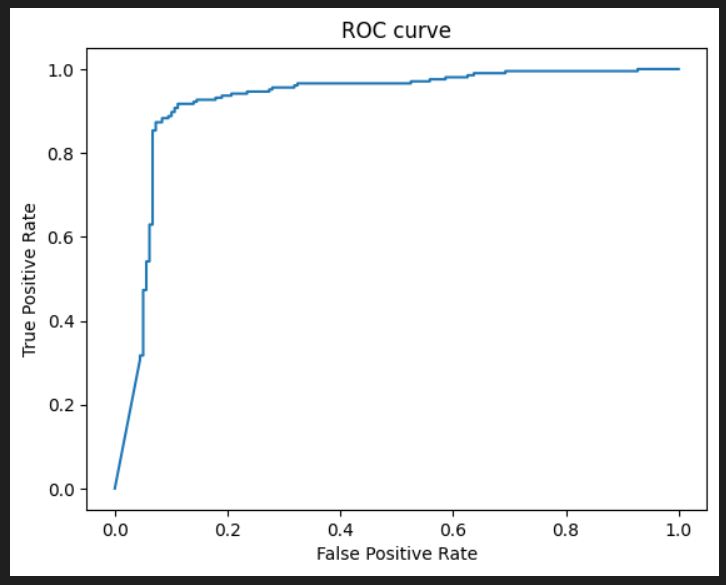
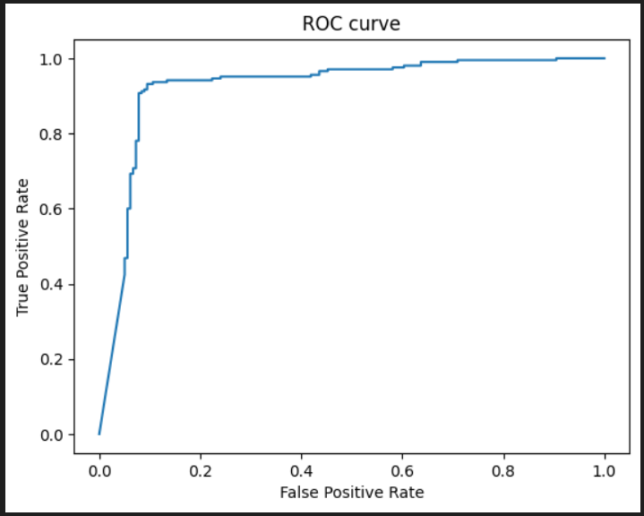

in_size = 8
hidd_size = 32
out_size = 1

AUC: 0.8158332197847118

---

err ~ 13% AUC: 0.8965254121814961

---

err < 10% AUC: 0.9214061861289004

---

err = 0.0917 AUC: 0.9238179588499795

no less err

Anomalys:

0.9999988921873806, 0.0

1.0, 0.0

1.0, 0.0

1.0, 0.0

1.0, 0.0

0.5194762038941217, 0.0

1.0, 0.0

1.0, 0.0

0.9975774718993673, 0.0

0.9999999999997202, 0.0

0.5820739200069639, 0.0

---

0.0008492050149322282, 1.0

1.1052117274910808e-07, 1.0

7.456301578150555e-10, 1.0

0.0018423803595694753, 1.0

0.39256849740173594, 1.0

7.521494207000941e-44, 1.0

0.07689984724151132, 1.0

0.048945346410337924, 1.0

0.00027727141588245873, 1.0

1.4030726796290474e-12, 1.0

2.646938869143332e-07, 1.0

0.0007788963169867464, 1.0