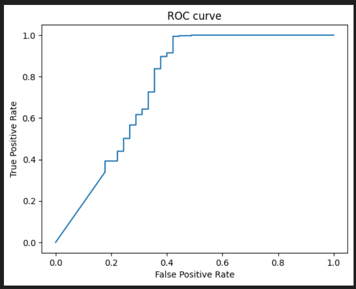

'age', 'BMI', 'gender', 'CD\\Ozhir', 'ComorbAll', 'L 109', 'LF', 'ROX' - 'Result'

in_size = 8
hidd_size = 32
out_size = 1

AUC:  0.761586365126188

y   e   err < 6%

1.0, 0.0

1.0, 0.0

0.9999999999999958, 0.0

0.9993959848701625, 0.0

0.999999999999996, 0.0

1.0, 0.0

1.0, 0.0

0.9999999532193646, 0.0

1.0, 0.0

0.987482074264572, 0.0

0.9999997100254451, 0.0

0.9930078331193515, 0.0

0.9999999999994498, 0.0

1.0, 0.0

0.9999883458374215, 0.0

0.9999999999423772, 0.0

0.6044897330527504, 0.0

1.0, 0.0

1.0, 0.0

---

0.2570128702856401, 1.0