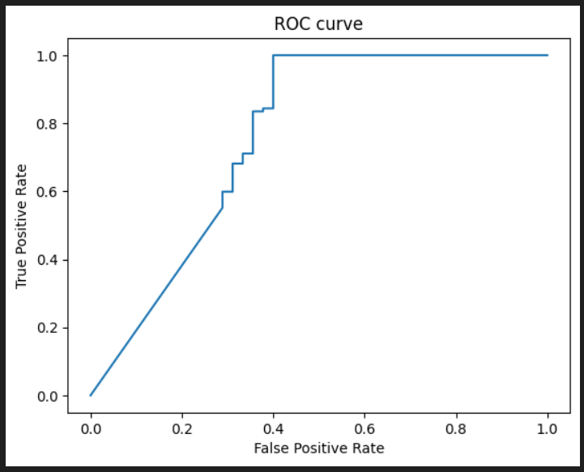

'age', 'BMI', 'gender', 'CD\\Ozhir', 'ComorbAll', 'L 109', 'LF', 'ROX' - 'Result'

in_size = 8
hidd_size = 32
out_size = 1

AUC:  0.761225827597509

y   e   err < 5%

1.0, 0.0

1.0, 0.0

1.0, 0.0

0.9999999999179947, 0.0

1.0, 0.0

1.0, 0.0

0.9999999999998621, 0.0

1.0, 0.0

1.0, 0.0

1.0, 0.0

0.9999977722913802, 0.0

1.0, 0.0

0.5765337868248656, 0.0

1.0, 0.0

1.0, 0.0

1.0, 0.0